# circles · nova

> A small generative-art script that fills a square with concentric rings.
> Originally hand-built before AI; later evolved — with AI — into glossy
> 3D-looking rings colored like slices of an abstract painting.

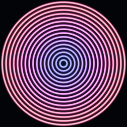
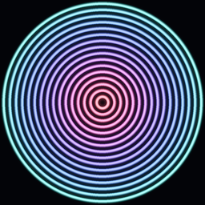
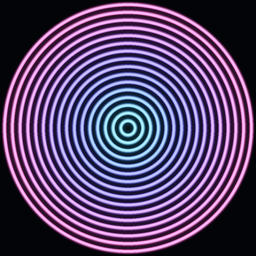

## The story

**circles** started as a personal project, written before AI tools were in the
picture. The idea was simple and entirely hand-made: draw a stack of nested
circles in a square and let them form hypnotic, gradient-colored targets. The
core color-blending trick came from a YouTube tutorial; turning it into a
generative **concentric-circle** art piece was the original author's own touch.

**circles · nova** is that same idea, taken further with AI as a collaborator.
The shape stayed true to the original — centered rings in a square — but the
rendering and color were reimagined.

## What was original

- Nested ellipses drawn in a square to form concentric "target" rings.
- A two-color gradient, blended ring to ring via linear color interpolation.
- Additive blending of each ring onto a near-black canvas.
- Run in a loop to produce a gallery of unique images.

## What AI added (the "nova" touches)

- **3D glossy-tube rings.** Each ring is still a flat 2D outline, but its
  stroke is shaded from dark edges up to a bright highlight across its width,
  so every line reads like a rounded, glossy wire/pipe.
- **Abstract-painting color.** Instead of two random colors, rings are colored
  from a lush master palette that flows orange → coral → rose → magenta →
  violet → indigo → azure → teal. Each image "catches" a smooth, continuous
  slice of it, so colors melt from one ring into the next — like a cutout of
  an abstract painting — with a touch of jitter so it feels hand-painted.
- **High-res render + downscale.** Drawn at 4× resolution and shrunk with
  LANCZOS resampling for clean, anti-aliased edges.
- **A limited soft glow.** A faint blurred halo under the rings for depth,
  kept subtle on purpose.
- **A proper CLI.** Control the number of images, size, ring count, output
  directory, color theme, and a random seed for reproducible output.

## Themes

Pick a palette with `--theme`:

- `nova` (default): the lush orange to teal painting gradient.
- `sunset`: gold burning down into night purple.
- `arctic`: icy whites and glacier blues.
- `neon`: electric colors that pop on black.
- `mono`: black & white (a silver to white grayscale ramp).

The same image (`--seed 21`) rendered in each theme:

| nova | sunset | arctic | neon | mono |
|:----:|:------:|:------:|:----:|:----:|
| 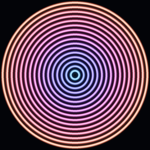 | 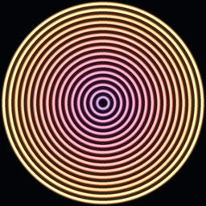 | 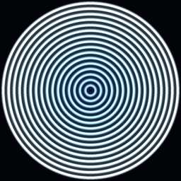 | 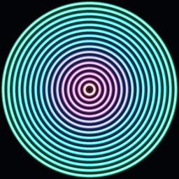 | 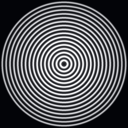 |

## Animated GIFs

Pass `--gif` to render a seamless looping GIF instead of static PNGs. Pick the
motion with `--style`:

| `ripple` | `flow` | `rippleflow` | `tunnel` |
|:--------:|:------:|:------------:|:--------:|
| 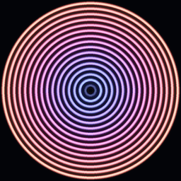 | 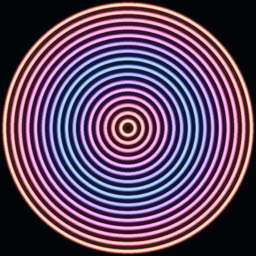 | 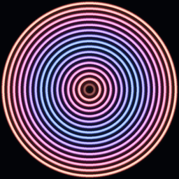 | 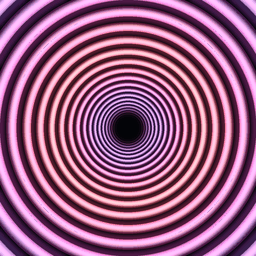 |
| rings drift inward | rings still, color flows inward | both at once | infinite zoom |

`tunnel` spaces the rings geometrically and scales the whole field by exactly
one ratio per loop, so you fall endlessly into the circle with no seam. For the
other styles the outermost ring is pinned and new rings are born behind it, so
nothing pops or fades in the rim. The loop is always exactly one second: the
single `--fps` knob sets both speed and smoothness, and is limited to 20, 25, or
50, the only rates that map to GIF's 1/100s frame delays exactly, so the timing
is always even and the loop is always perfect.

### Trippy motion pack

Four more hypnotic styles, all seamless one-second loops:

| `twist` | `breathing` | `kaleidoscope` | `interference` |
|:-------:|:-----------:|:--------------:|:--------------:|
| 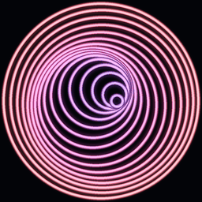 | 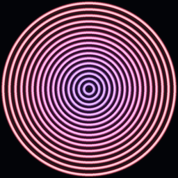 | 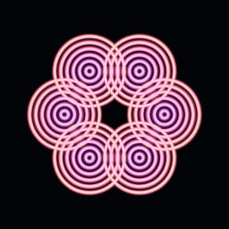 | 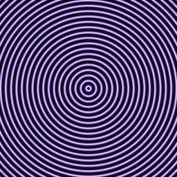 |
| spiralling vortex | asymmetric in/out pulse | rotating mandala | drifting moire |

- **twist** spirals the rings off-center, further the deeper they go, and winds the whole vortex round once per loop.
- **breathing** swells and shrinks the rings like a chest, deliberately lop-sided (a quick inhale, a slow exhale) and travelling inward.
- **kaleidoscope** orbits one off-center cluster and folds the frame into six mirrored segments, so it reads as a slowly turning mandala.
- **interference** overlays two families of fine rings from two centers that drift apart and back, rippling with shifting moire bands.

```bash
python main.py --gif                     # ripple GIFs into imgs/
python main.py --gif --style flow         # still rings, flowing color
python main.py --gif --style rippleflow   # both
python main.py --gif --style tunnel       # infinite zoom
python main.py --gif --style twist        # spiralling vortex
python main.py --gif --style interference # drifting moire
python main.py --gif --fps 50             # smoothest
```

## Shapes

By default the rings are circles. Pass `--shape` to draw them as any regular
polygon instead, `superellipse` for a soft rounded square, or `star`:

| `triangle` | `square` | `hexagon` | `star` | `superellipse` |
|:----------:|:--------:|:---------:|:------:|:--------------:|
| 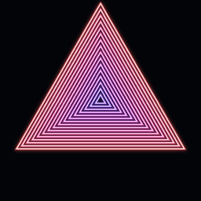 | 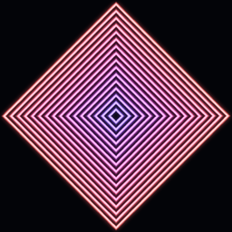 | 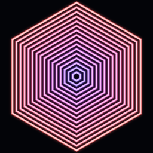 | 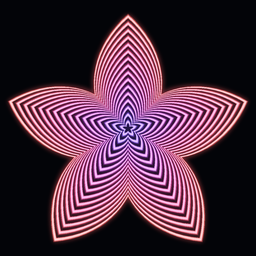 | 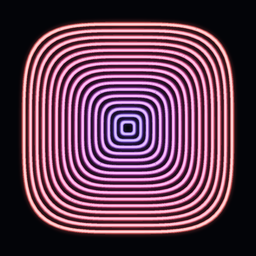 |

`--shape` works for both static PNGs and `--gif`. For GIFs there is also a
special `morph` shape that smoothly cycles the rings through every shape and
loops seamlessly:

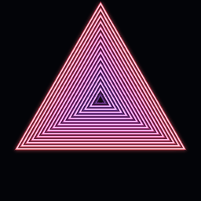

```bash
python main.py --shape star               # five-pointed star rings
python main.py --shape hexagon -s 512     # bigger hexagons
python main.py --gif --shape morph        # rings morph shape over the loop
```

## Output size & quality

- `--size` sets the pixel dimensions and is the real resolution lever. Images
  are always rendered at 4x and downscaled, so larger sizes stay crisp.
- `--dpi` writes DPI metadata onto the saved PNG for print sizing. It does not
  change the pixels, only how large the image prints (use `--size` for detail).
  GIF has no resolution field, so `--dpi` is accepted with `--gif` but only
  affects PNG output.

```bash
python main.py -s 1024 --dpi 300   # high-res, print-ready PNGs
```

The same center detail, enlarged, from a low and a high `--size` render. More
size means more real detail:

| `--size 256` | `--size 1024` |
|:------------:|:-------------:|
| 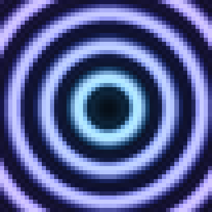 | 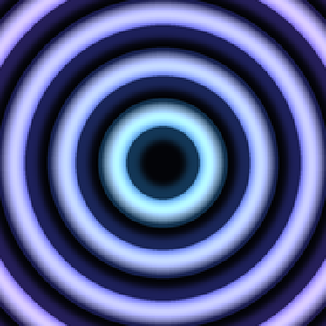 |

A full high-res sample (`-s 512 --dpi 300`):

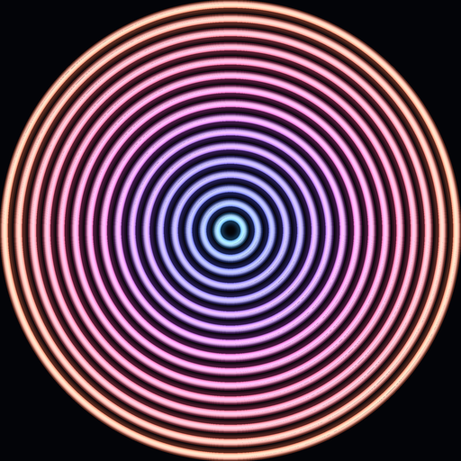

## Mix and match

The options compose freely. `--theme` recolors every style and shape, `--shape`
applies to static images and to every GIF style (including a star-shaped tunnel
or a triangular moire), and `--size`, `--rings`, `--fps`, `--seed` work
throughout. A star-shaped, sunset-themed tunnel (`--gif --style tunnel --shape
star --theme sunset`):

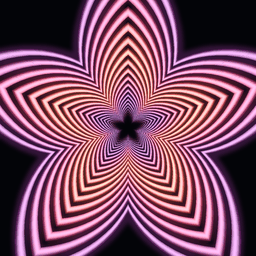

```bash
python main.py --shape hexagon --theme arctic            # static arctic hexagons
python main.py --gif --style tunnel --shape star --theme sunset
python main.py --gif --style interference --shape triangle --theme neon
python main.py --gif --style kaleidoscope --theme mono --fps 50
```

What goes with what:

| Option | Static PNG | GIF (`--gif`) |
|:-------|:----------:|:-------------:|
| `--theme` (nova/sunset/arctic/neon/mono) | yes | yes |
| `--shape` (triangle/square/…/star/superellipse) | yes | yes (every style) |
| `--shape morph` | no (needs a loop) | yes |
| `--style` (ripple/…/tunnel/twist/breathing/kaleidoscope/interference) | n/a | yes |
| `--fps` (20/25/50) | n/a | yes |
| `--size`, `--rings`, `--count`, `--seed` | yes | yes |
| `--dpi` | yes | accepted, but GIF has no DPI field |

## Usage

```bash
pip install -r requirements.txt
python main.py                 # 16 images into imgs/
python main.py --seed 7        # reproducible output
python main.py -n 8 -s 512 -r 20
python main.py --gif -s 512    # 512px looping GIFs
python main.py --theme mono    # black & white
python main.py -s 1024 --dpi 300
```

### Options

```
-n, --count    number of images to generate (default: 16)
-s, --size     output image size in pixels (default: 256)
-r, --rings    number of rings per image (default: 16)
-o, --out-dir  output directory (default: imgs)
-t, --theme    color theme: nova, sunset, arctic, neon, mono (default: nova)
    --gif      render a seamless looping GIF instead of static PNGs
    --style    GIF motion: ripple, flow, rippleflow, tunnel, twist, breathing,
               kaleidoscope, interference (default: ripple)
    --fps      GIF speed and smoothness: 20, 25, or 50; loop is always 1s (default: 25)
    --shape    ring shape: circle, triangle, square, pentagon, hexagon, star,
               superellipse, or morph (GIF only) (default: circle)
    --dpi      DPI metadata for saved files (print sizing; default: unset)
    --seed     random seed for reproducible output
```

## Credits

- Original concept, concentric-circle generator, and code: the repository owner.
- Color-interpolation technique: adapted from a YouTube tutorial.
- "nova" rendering & color reimagining: built collaboratively with AI.
